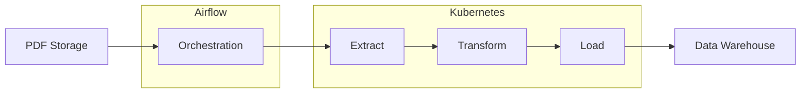

# Hành trình khám phá Airflow: Từ AI Scientist đến AI Architecture

Trong thế giới công nghệ đang không ngừng phát triển, ranh giới giữa các lĩnh vực ngày càng trở nên mờ nhạt. Câu chuyện của tôi bắt đầu từ vai trò một AI scientist mang xuất thân từ Software Engineering. Nhưng chính những dự án lớn đã mở ra cho tôi một góc nhìn hoàn toàn mới về thế giới AI và data.

Tôi và team của mình đã dành một năm để xây dựng một mô hình tối ưu giao vận cho một tập đoàn tiêu dùng hàng đầu thế giới. Ban đầu, mọi thứ diễn ra suôn sẻ. Mô hình của chúng tôi đã thành công và được người dùng ở tổng công ty (Head Quarter) chấp thuận. Tuy nhiên, khi chúng tôi bắt đầu mở rộng quy mô ra đa quốc gia, những thách thức thực sự mới xuất hiện:

1. **Đa dạng dữ liệu và quy tắc**: Mỗi quốc gia có một kiểu dữ liệu, quy tắc và ràng buộc trong logistics khác nhau. Điều này đòi hỏi chúng tôi phải liên tục điều chỉnh và tùy chỉnh mô hình cho từng thị trường.

2. **Khối lượng dữ liệu khổng lồ**: Dữ liệu lên tới 500 TB mỗi ngày, và hệ thống cần chạy 40 lần một ngày cho một quốc gia. Việc xử lý và phân tích lượng dữ liệu này đòi hỏi một cơ sở hạ tầng mạnh mẽ và linh hoạt.

3. **Phức tạp trong quy trình**: Khi áp dụng vào thực tế kinh doanh, chúng tôi phải phát triển hơn 200 scripts/logic để thu thập và làm sạch dữ liệu cho tất cả các quốc gia. Việc quản lý và duy trì số lượng lớn các script này trở thành một thách thức lớn.

Đối mặt với những thách thức này, tôi nhận ra rằng AI không chỉ dừng lại ở việc xây dựng các model thông minh. Đó là cả một hệ sinh thái phức tạp, đòi hỏi sự tối ưu trong mọi khía cạnh: từ lưu trữ, xử lý, đến khả năng phục hồi và sao lưu dữ liệu.

Bước ngoặt đến khi chúng tôi quyết định áp dụng một kiến trúc đột phá: toàn bộ hệ thống được xây dựng trên nền tảng Airflow, kết hợp với Kubernetes và data lake. Sự kết hợp này không chỉ đơn thuần là một giải pháp kỹ thuật; nó là một tầm nhìn về cách vận hành và mở rộng hệ thống data hiện đại.

Airflow đảm nhận vai trò điều phối, trong khi Kubernetes hỗ trợ việc mở rộng tài nguyên một cách linh hoạt. Đây là lúc tôi nhận ra rằng thế giới AI đã vượt xa khỏi mô hình đơn giản "Input -> Model -> Output". Nó bao gồm cả một chuỗi các quy trình phức tạp: làm sạch dữ liệu, học máy liên tục, đánh dấu vấn đề dữ liệu, tự động đào tạo lại, sao lưu và khôi phục.

Trong hành trình này, vai trò của AI Solution Architect trở nên quan trọng hơn bao giờ hết. Và Airflow, công cụ mà tôi sắp giới thiệu với bạn, đã trở thành người bạn đồng hành đắc lực trong việc xây dựng và quản lý các quy trình phức tạp này.

Hãy cùng tôi khám phá Airflow - không chỉ như một công cụ, mà là một giải pháp toàn diện cho những thách thức trong thế giới AI và data engineering hiện đại.

# Airflow: Người bạn đồng hành trong hành trình Data Engineering

Khi tôi bắt đầu tìm hiểu về Airflow, tôi như được mở ra một cánh cửa mới trong thế giới data engineering. Apache Airflow, một nền tảng mã nguồn mở được Airbnb phát triển vào năm 2014, đã nhanh chóng trở thành một công c��� không thể thiếu trong hành trang của các kỹ sư dữ liệu và phần mềm.

Điều đầu tiên khiến tôi ấn tượng với Airflow là khả năng định nghĩa các quy trình công việc dưới dạng mã Python. Đối với một người có nền tảng về lập trình như tôi, điều này mang lại một cảm giác quen thuộc và thoải mái. Tôi có thể dễ dàng mô tả các tác vụ phức tạp và mối quan hệ giữa chúng thông qua các Directed Acyclic Graphs (DAGs). Đây chính là sức mạnh của Airflow - biến những quy trình phức tạp thành các biểu đồ trực quan, dễ hiểu và quản lý.

Trong dự án giao vận toàn cầu mà tôi tham gia, chúng tôi phải đối mặt với hàng loạt thách thức: từ việc xử lý dữ liệu từ nhiều nguồn khác nhau, đến việc đảm bảo các model AI được cập nhật liên tục. Airflow đã chứng tỏ giá trị của mình qua những tính năng nổi bật:

1. **Lập lịch linh hoạt**: Chúng tôi có thể dễ dàng thiết lập các quy trình chạy định kỳ, từ việc cập nhật dữ liệu hàng giờ đến việc đào tạo lại model hàng tuần. Điều này giúp chúng tôi tự động hóa nhiều quy trình, giảm thiểu sự can thiệp thủ công và tăng hiệu quả làm việc.

2. **Giám sát và quản lý**: Giao diện người dùng của Airflow là một công cụ mạnh mẽ giúp chúng tôi theo dõi tiến trình của các quy trình. Tôi còn nhớ một lần, nhờ có dashboard của Airflow, chúng tôi đã nhanh chóng phát hiện và xử lý một lỗi trong quá trình xử lý dữ liệu, tránh được một sự cố lớn có thể ảnh hưởng đến toàn bộ hệ thống.

3. **Khả năng mở rộng**: Khi khối lượng dữ liệu và số lượng người dùng của chúng tôi tăng lên, Airflow đã cho thấy khả năng thích ứng tuyệt vời. Kết hợp với Kubernetes, chúng tôi có thể dễ dàng mở rộng tài nguyên để đáp ứng nhu cầu ngày càng tăng.

4. **Tích hợp dễ dàng**: Một trong những điểm mạnh của Airflow là khả năng tích hợp với nhiều công cụ và dịch vụ khác. Trong dự án của chúng tôi, Airflow đóng vai trò như một trung tâm điều phối, kết nối seamlessly với các dịch vụ đám mây, cơ sở dữ liệu, và các công cụ phân tích.

Qua trải nghiệm làm việc với Airflow, tôi nhận ra rằng nó không chỉ là một công cụ lập lịch đơn thuần. Nó là một giải pháp toàn diện cho việc xây dựng, qu���n lý và vận hành các pipeline dữ liệu phức tạp. Từ việc làm sạch dữ liệu, triển khai model AI, đến việc tạo báo cáo tự động, Airflow đã trở thành xương sống cho toàn bộ hệ thống data và analytics của chúng tôi.

Tuy nhiên, như mọi công cụ mạnh mẽ khác, Airflow cũng đòi hỏi một đường cong học tập nhất định. Nó không phải là giải pháp phù hợp cho mọi dự án, đặc biệt là những dự án nhỏ với quy trình đơn giản. Nhưng đối với những ai đang tìm kiếm một giải pháp mạnh mẽ để xây dựng và quản lý các quy trình dữ liệu phức tạp, Airflow chắc chắn là một lựa chọn đáng cân nhắc.

# Airflow có phù hợp với bạn không?

Qua hành trình của mình, tôi nhận ra rằng việc lựa chọn công cụ phù hợp là vô cùng quan trọng. Vậy làm sao để biết Airflow có phải là lựa chọn đúng đắn cho bạn? Hãy cùng tôi xem xét một số yếu tố quan trọng:

1. **Độ phức tạp của quy trình công việc**: 
   Nếu quy trình của bạn bao gồm nhiều bước phụ thuộc lẫn nhau, cần xử lý song song hoặc có điều kiện, Airflow sẽ là một lựa chọn tuyệt vời. Trong dự án của chúng tôi, việc phải xử lý dữ liệu từ nhiều nguồn khác nhau, áp dụng các model AI, và tạo báo cáo - tất cả theo một trình tự cụ thể - đã khiến Airflow trở nên không thể thiếu.

2. **Ngôn ngữ lập trình**: 
   Airflow sử dụng Python để định nghĩa các quy trình. Nếu bạn và team của bạn đã quen thuộc với Python, việc áp dụng Airflow sẽ trở nên dễ dàng hơn rất nhiều.

3. **Tần suất và lịch trình**: 
   Nếu bạn cần chạy các tác vụ theo lịch trình định kỳ hoặc dựa trên các sự kiện cụ thể, Airflow sẽ là một công cụ đắc lực. Chúng tôi đã sử dụng tính năng này để tự động hóa việc cập nhật dữ liệu, đào tạo lại model, và tạo báo cáo định kỳ.

4. **Khả năng mở rộng**: 
   Nếu bạn dự đoán rằng khối lượng công việc sẽ tăng đáng kể trong tương lai, Airflow sẽ là một lựa chọn sáng suốt. Khả năng tích hợp với Kubernetes của nó cho phép bạn dễ dàng mở rộng quy mô khi cần thiết.

5. **Yêu cầu giám sát và quản lý**: 
   Giao diện web của Airflow cung cấp một cái nhìn tổng quan về toàn bộ quy trình, giúp bạn dễ dàng theo dõi và quản lý. Điều này đặc biệt hữu ích khi bạn cần nhanh chóng phát hiện và xử lý các vấn đề.

6. **Tích hợp với các công cụ khác**: 
   Nếu hệ thống của bạn cần tương tác với nhiều dịch vụ và công cụ khác nhau, Airflow sẽ là một lựa chọn tuyệt vời nhờ khả năng tích hợp mạnh mẽ của nó.

7. **Quy mô của dự án**: 
   Airflow thường phù hợp nhất với các dự án trung bình đến lớn. Đối với các dự án nhỏ, việc triển khai Airflow có thể là "quá sức" và không cần thiết.

8. **Tài nguyên và kiến thức kỹ thuật**: 
   Cuối cùng, hãy đảm bảo rằng bạn và team của mình có đủ kiến thức và tài nguyên để triển khai và duy trì Airflow. Mặc dù công cụ này mạnh mẽ, nhưng nó cũng đòi hỏi một mức độ hiểu biết kỹ thuật nhất định.

Qua trải nghiệm của mình, tôi nhận thấy Airflow đặc biệt phù hợp cho các dự án có quy trình phức tạp, cần tự động hóa cao, và có khả năng mở rộng trong tương lai. Nó đã giúp chúng tôi chuyển đổi từ một hệ thống quản lý công việc rời rạc sang một pipeline dữ liệu mạnh mẽ, linh hoạt và dễ quản lý.

# Ví dụ về kiến trúc sử dụng Airflow cho ETL từ file PDF

Airflow là một công cụ mạnh mẽ cho việc điều phối và quản lý quy trình ETL (Extract, Transform, Load). Hãy xem xét một ví dụ về việc sử dụng Airflow để điều phối quy trình xử lý dữ liệu từ một danh sách các file PDF.

## Thiết kế hệ thống

Dưới đây là sơ đồ thiết kế hệ thống cho quy trình ETL này:

1. **PDF Storage**: Nơi lưu trữ các file PDF cần xử lý.
2. **Airflow**: Điều phối và quản lý toàn bộ quy trình ETL.
   - **Orchestration**: Quản lý và điều phối các bước trong quy trình.
3. **Kubernetes**: Thực thi các công việc xử lý dữ liệu nặng.
   - **Extract**: Trích xuất dữ liệu thô từ các file PDF.
   - **Transform**: Xử lý và chuyển đổi dữ liệu thô thành định dạng mong muốn.
   - **Load**: Tải dữ liệu đã xử lý vào kho dữ liệu.
4. **Data Warehouse**: Nơi lưu trữ dữ liệu cuối cùng.

## DAG Jobnet

Dưới đây là một ví dụ về DAG jobnet cho quy trình ETL này:

1. **Start**: Bắt đầu quy trình.
2. **Get PDF List**: Lấy danh sách các file PDF cần xử lý.
3. **Extract Data**: Trích xuất dữ liệu từ mỗi file PDF.
4. **Transform Data**: Xử lý và chuẩn hóa dữ liệu.
5. **Load Data**: Tải dữ liệu vào kho dữ liệu.
6. **Update Metadata**: Cập nhật thông tin về quá trình xử lý.
7. **End**: Kết thúc quy trình.

Mỗi bước trong DAG này có thể được triển khai như một task riêng biệt trong Airflow, cho phép bạn theo dõi và quản lý từng bước của quy trình một cách chi tiết.

## Lợi ích của việc sử dụng Airflow cho ETL từ PDF

1. **Quy hoạch, modular**: 
   Khi phát triển với Airflow, bạn sẽ tập trung vào các DAG files. Điều này mang lại một lợi thế to lớn trong việc quản lý và phát triển hệ thống, đặc biệt là đối với các dự án quy mô lớn. 
   
   Tôi còn nhớ trong dự án giao vận toàn cầu của mình, chúng tôi đã phải đối mặt với một hệ thống cực kỳ phức tạp. Tuy nhiên, nhờ có Airflow, chúng tôi đã có thể chia nhỏ hệ thống thành các module độc lập. Điều này cho phép các team làm việc song song trên các phần khác nhau của hệ thống mà không cần lo lắng về việc xung đột hay ảnh hưởng lẫn nhau.

   Một ví dụ cụ thể là khi chúng tôi muốn bổ sung thêm một module tiền xử lý dữ liệu để trích xuất thông tin thời tiết như một feature bổ sung. Thay vì phải làm việc trên một codebase đồ sộ và một database khổng lồ của model chính, developer chỉ cần tạo một DAG file mới - một file Python nhỏ gọn. Họ có thể tập trung vào việc code chức năng load dữ liệu thời tiết và đẩy dữ liệu lên data lake mà không cần quan tâm đến phần còn lại của hệ thống.

   Cách tiếp cận này không chỉ giúp quá trình phát triển trở nên nhanh chóng và hiệu quả hơn, mà còn giúp việc setup môi trường, phát triển và kiểm thử trở nên nhẹ nhàng hơn rất nhiều. Tôi còn nhớ nụ cười hạnh phúc của các developer khi họ không phải vật lộn với toàn bộ hệ thống chỉ để thêm một tính năng nhỏ.

... ngoài ra

2. **Tự động hóa**: Airflow cho phép bạn tự động hóa toàn bộ quy trình, từ việc lấy danh sách PDF đến việc tải dữ liệu vào kho.

3. **Lập lịch linh hoạt**: Bạn có thể dễ dàng lập lịch cho quy trình ETL chạy theo định kỳ hoặc kích hoạt bởi các sự kiện cụ thể.

4. **Xử lý lỗi**: Airflow cung cấp các cơ chế mạnh mẽ để xử lý lỗi và thử lại các task thất bại.

5. **Mở rộng**: Khi số lượng PDF tăng lên, bạn có thể dễ dàng mở rộng quy trình bằng cách thêm các worker.

6. **Giám sát**: Giao diện web của Airflow cho phép bạn theo dõi tiến trình và hiệu suất của quy trình ETL một cách trực quan.